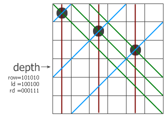
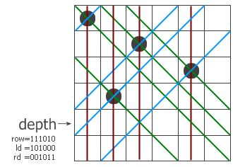

# Contents

- [基本操作](#基本操作)
	- [二进制中的1有奇数个还是偶数个](#二进制中的1有奇数个还是偶数个)
	- [计算二进制中的1的个数](#计算二进制中的1的个数)
	- [二分查找32位整数的前导0个数](#二分查找32位整数的前导0个数)
- [应用](#应用)
	- [只用位运算来取绝对值](#只用位运算来取绝对值)
	- [高低位交换](#高低位交换)
	- [二进制逆序](#二进制逆序)
	- [n皇后问题位运算版](#n皇后问题位运算版)
	- [Gray码](#gray码)

转自 [matrix67](http://www.matrix67.com/)

### 基本操作
    功能              |           示例            |    位运算
--------------------- | --------------------------| -----------
去掉最后一位          | (101101->10110)           | x shr 1
在最后加一个0         | (101101->1011010)         | x shl 1
在最后加一个1         | (101101->1011011)         | x shl 1+1
把最后一位变成1       | (101100->101101)          | x or 1
把最后一位变成0       | (101101->101100)          | x or 1-1
最后一位取反          | (101101->101100)          | x xor 1
把右数第k位变成1      | (101001->101101,k=3)      | x or (1 shl (k-1))
把右数第k位变成0      | (101101->101001,k=3)      | x and not (1 shl (k-1))
右数第k位取反         | (101001->101101,k=3)      | x xor (1 shl (k-1))
取末三位              | (1101101->101)            | x and 7
取末k位               | (1101101->1101,k=5)       | x and (1 shl k-1)
取右数第k位           | (1101101->1,k=4)          | x shr (k-1) and 1
把末k位变成1          | (101001->101111,k=4)      | x or (1 shl k-1)
末k位取反             | (101001->100110,k=4)      | x xor (1 shl k-1)
把右边连续的1变成0    | (100101111->100100000)    | x and (x+1)
把右起第一个0变成1    | (100101111->100111111)    | x or (x+1)
把右边连续的0变成1    | (11011000->11011111)      | x or (x-1)
取右边连续的1         | (100101111->1111)         | (x xor (x+1)) shr 1
取出最后一个1         | (100010100->100)          | x and (x xor (x-1))
去掉末尾的0           | (100010100->1000101)      |x div (x and (x xor (i-1)))

### 二进制中的1有奇数个还是偶数个
 我们可以用下面的代码来计算一个32位整数的二进制中1的个数的奇偶性，当输入数据的二进制表示里有偶数个数字1时程序输出0，有奇数个则输出1。例如，1314520的二进制101000000111011011000中有9个1，则x=1314520时程序输出1。
```pascal
var
   i,x,c:longint;
begin
   readln(x);
   c:=0;
   for i:=1 to 32 do
   begin
      c:=c + x and 1;
      x:=x shr 1;
   end;
   writeln( c and 1 );
end.
```

但这样的效率并不高，位运算的神奇之处还没有体现出来。

同样是判断二进制中1的个数的奇偶性，下面这段代码就强了。你能看出这个代码的原理吗？

```pascal
var
   x:longint;
begin
   readln(x);
   x:=x xor (x shr 1);
   x:=x xor (x shr 2);
   x:=x xor (x shr 4);
   x:=x xor (x shr 8);
   x:=x xor (x shr 16);
   writeln(x and 1);
end.
```


为了说明上面这段代码的原理，我们还是拿1314520出来说事。1314520的二进制为101000000111011011000，第一次异或操作的结果如下：

```
    00000000000101000000111011011000
XOR  0000000000010100000011101101100
---------------------------------------
    00000000000111100000100110110100
```

得到的结果是一个新的二进制数，其中右起第i位上的数表示原数中第i和i+1位上有奇数个1还是偶数个1。比如，最右边那个0表示原数末两位有偶数个1，右起第3位上的1就表示原数的这个位置和前一个位置中有奇数个1。对这个数进行第二次异或的结果如下：

```
    00000000000111100000100110110100
XOR   000000000001111000001001101101
---------------------------------------
    00000000000110011000101111011001
```
结果里的每个1表示原数的该位置及其前面三个位置中共有奇数个1，每个0就表示原数对应的四个位置上共偶数个1。一直做到第五次异或结束后，得到的二进制数的最末位就表示整个32位数里有多少个1，这就是我们最终想要的答案。


### 计算二进制中的1的个数
同样假设x是一个32位整数。经过下面五次赋值后，x的值就是原数的二进制表示中数字1的个数。比如，初始时x为1314520（网友抓狂：能不能换一个数啊），那么最后x就变成了9，它表示1314520的二进制中有9个1。

```pascal
x := (x and $55555555) + ((x shr 1) and $55555555);
x := (x and $33333333) + ((x shr 2) and $33333333);
x := (x and $0F0F0F0F) + ((x shr 4) and $0F0F0F0F);
x := (x and $00FF00FF) + ((x shr 8) and $00FF00FF);
x := (x and $0000FFFF) + ((x shr 16) and $0000FFFF);
```

为了便于解说，我们下面仅说明这个程序是如何对一个8位整数进行处理的。我们拿数字211（我们班某MM的生日）来开刀。211的二进制为11010011。

```
+---+---+---+---+---+---+---+---+
| 1 | 1 | 0 | 1 | 0 | 0 | 1 | 1 |   <---原数
+---+---+---+---+---+---+---+---+
|  1 0  |  0 1  |  0 0  |  1 0  |   <---第一次运算后
+-------+-------+-------+-------+
|    0 0 1 1    |    0 0 1 0    |   <---第二次运算后
+---------------+---------------+
|        0 0 0 0 0 1 0 1        |   <---第三次运算后，得数为5
+-------------------------------+
```

整个程序是一个分治的思想。第一次我们把每相邻的两位加起来，得到每两位里1的个数，比如前两位10就表示原数的前两位有2个1。第二次我们继续两两相加，10+01=11，00+10=10，得到的结果是00110010，它表示原数前4位有3个1，末4位有2个1。最后一次我们把0011和0010加起来，得到的就是整个二进制中1的个数。程序中巧妙地使用取位和右移，比如第二行中$33333333的二进制为00110011001100....，用它和x做and运算就相当于以2为单位间隔取数。shr的作用就是让加法运算的相同数位对齐。

### 二分查找32位整数的前导0个数
这里用的C语言，我直接Copy的Hacker's Delight上的代码。这段代码写成C要好看些，写成Pascal的话会出现很多begin和end，搞得代码很难看。程序思想是二分查找，应该很简单，我就不细说了。

```pascal
int nlz(unsigned x)
{
   int n;

   if (x == 0) return(32);
   n = 1;
   if ((x >> 16) == 0) {n = n +16; x = x <<16;}
   if ((x >> 24) == 0) {n = n + 8; x = x << 8;}
   if ((x >> 28) == 0) {n = n + 4; x = x << 4;}
   if ((x >> 30) == 0) {n = n + 2; x = x << 2;}
   n = n - (x >> 31);
   return n;
}
```

## 应用
### 只用位运算来取绝对值
这是一个非常有趣的问题。
答案：假设x为32位整数，则x xor (not (x shr 31) + 1) + x shr 31的结果是x的绝对值
x shr 31是二进制的最高位，它用来表示x的符号。如果它为0（x为正），则not (x shr 31) + 1等于$00000000，异或任何数结果都不变；如果最高位为1（x为负），则not (x shr 31) + 1等于$FFFFFFFF，x异或它相当于所有数位取反，异或完后再加一。

### 高低位交换
给出一个小于2^32的正整数。这个数可以用一个32位的二进制数表示（不足32位用0补足）。我们称这个二进制数的前16位为“高位”，后16位为“低位”。将它的高低位交换，我们可以得到一个新的数。试问这个新的数是多少（用十进制表示）。
例如，数1314520用二进制表示为0000 0000 0001 0100 0000 1110 1101 1000（添加了11个前导0补足为32位），其中前16位为高位，即0000 0000 0001 0100；后16位为低位，即0000 1110 1101 1000。将它的高低位进行交换，我们得到了一个新的二进制数0000 1110 1101 1000 0000 0000 0001 0100。它即是十进制的249036820。

```pascal
var
   n:dword;
begin
   readln( n );
   writeln( (n shr 16) or (n  shl 16) );
end.
```

### 二进制逆序
下面的程序读入一个32位整数并输出它的二进制倒序后所表示的数。
    输入： 1314520    （二进制为00000000000101000000111011011000）
    输出： 460335104  （二进制为00011011011100000010100000000000）
```pascal
var
   x:dword;
begin
   readln(x);
   x := (x and $55555555) shl  1 or (x and $AAAAAAAA) shr  1;
   x := (x and $33333333) shl  2 or (x and $CCCCCCCC) shr  2;
   x := (x and $0F0F0F0F) shl  4 or (x and $F0F0F0F0) shr  4;
   x := (x and $00FF00FF) shl  8 or (x and $FF00FF00) shr  8;
   x := (x and $0000FFFF) shl 16 or (x and $FFFF0000) shr 16;
   writeln(x);
end.
```

它的原理和刚才求二进制中1的个数那个例题是大致相同的。程序首先交换每相邻两位上的数，以后把互相交换过的数看成一个整体，继续进行以2位为单位、以4位为单位的左右对换操作。我们再次用8位整数211来演示程序执行过程：
```
+---+---+---+---+---+---+---+---+
| 1 | 1 | 0 | 1 | 0 | 0 | 1 | 1 |   <---原数
+---+---+---+---+---+---+---+---+
|  1 1  |  1 0  |  0 0  |  1 1  |   <---第一次运算后
+-------+-------+-------+-------+
|    1 0 1 1    |    1 1 0 0    |   <---第二次运算后
+---------------+---------------+
|        1 1 0 0 1 0 1 1        |   <---第三次运算后
+-------------------------------+
```


### n皇后问题位运算版
n皇后问题是啥我就不说了吧，学编程的肯定都见过。下面的十多行代码是n皇后问题的一个高效位运算程序，看到过的人都夸它牛。初始时，upperlim:=(1 shl n)-1。主程序调用test(0,0,0)后sum的值就是n皇后总的解数。拿这个去交USACO，0.3s，暴爽。
```pascal
procedure test(row,ld,rd:longint);
var
      pos,p:longint;
begin

      if row<>upperlim then
      begin
         pos:=upperlim and not (row or ld or rd);
         while pos<>0 do
         begin
            p:=pos and -pos;
            pos:=pos-p;
            test(row+p,(ld+p)shl 1,(rd+p)shr 1);
         end;
      end
      else inc(sum);
end;
```
乍一看似乎完全摸不着头脑，实际上整个程序是非常容易理解的。这里还是建议大家自己单步运行一探究竟，实在没研究出来再看下面的解说。




和普通算法一样，这是一个递归过程，程序一行一行地寻找可以放皇后的地方。过程带三个参数，row、ld和rd，分别表示在纵列和两个对角线方向的限制条件下这一行的哪些地方不能放。我们以6x6的棋盘为例，看看程序是怎么工作的。假设现在已经递归到第四层，前三层放的子已经标在左图上了。红色、蓝色和绿色的线分别表示三个方向上有冲突的位置，位于该行上的冲突位置就用row、ld和rd中的1来表示。把它们三个并起来，得到该行所有的禁位，取反后就得到所有可以放的位置（用pos来表示）。前面说过-a相当于not a + 1，这里的代码第6行就相当于pos and (not pos + 1)，其结果是取出最右边的那个1。这样，p就表示该行的某个可以放子的位置，把它从pos中移除并递归调用test过程。注意递归调用时三个参数的变化，每个参数都加上了一个禁位，但两个对角线方向的禁位对下一行的影响需要平移一位。最后，如果递归到某个时候发现row=111111了，说明六个皇后全放进去了，此时程序从第1行跳到第11行，找到的解的个数加一。

### Gray码
 假如我有4个潜在的GF，我需要决定最终到底和谁在一起。一个简单的办法就是，依次和每个MM交往一段时间，最后选择给我带来的“满意度”最大的MM。但看了dd牛的理论后，事情开始变得复杂了：我可以选择和多个MM在一起。这样，需要考核的状态变成了2^4=16种（当然包括0000这一状态，因为我有可能是玻璃）。现在的问题就是，我应该用什么顺序来遍历这16种状态呢？

 传统的做法是，用二进制数的顺序来遍历所有可能的组合。也就是说，我需要以0000->0001->0010->0011->0100->...->1111这样的顺序对每种状态进行测试。这个顺序很不科学，很多时候状态的转移都很耗时。比如从0111到1000时我需要暂时甩掉当前所有的3个MM，然后去把第4个MM。同时改变所有MM与我的关系是一件何等巨大的工程啊。因此，我希望知道，是否有一种方法可以使得，从没有MM这一状态出发，每次只改变我和一个MM的关系（追或者甩），15次操作后恰好遍历完所有可能的组合（最终状态不一定是1111）。大家自己先试一试看行不行。

 解决这个问题的方法很巧妙。我们来说明，假如我们已经知道了n=2时的合法遍历顺序，我们如何得到n=3的遍历顺序。显然，n=2的遍历顺序如下：
```
00
01
11
10
```
你可能已经想到了如何把上面的遍历顺序扩展到n=3的情况。n=3时一共有8种状态，其中前面4个把n=2的遍历顺序照搬下来，然后把它们对称翻折下去并在最前面加上1作为后面4个状态：
```
000
001
011
010  ↑
--------
110  ↓
111
101
100
```
用这种方法得到的遍历顺序显然符合要求。首先，上面8个状态恰好是n=3时的所有8种组合，因为它们是在n=2的全部四种组合的基础上考虑选不选第3个元素所得到的。然后我们看到，后面一半的状态应该和前面一半一样满足“相邻状态间仅一位不同”的限制，而“镜面”处则是最前面那一位数不同。再次翻折三阶遍历顺序，我们就得到了刚才的问题的答案：
```
0000
0001
0011
0010
0110
0111
0101
0100
1100
1101
1111
1110
1010
1011
1001
1000
```
这种遍历顺序作为一种编码方式存在，叫做Gray码（写个中文让蜘蛛来抓：格雷码）。它的应用范围很广。比如，n阶的Gray码相当于在n维立方体上的Hamilton回路，因为沿着立方体上的边走一步，n维坐标中只会有一个值改变。再比如，Gray码和Hanoi塔问题等价。Gray码改变的是第几个数，Hanoi塔就该移动哪个盘子。比如，3阶的Gray码每次改变的元素所在位置依次为1-2-1-3-1-2-1，这正好是3阶Hanoi塔每次移动盘子编号。如果我们可以快速求出Gray码的第n个数是多少，我们就可以输出任意步数后Hanoi塔的移动步骤。现在我告诉你，Gray码的第n个数（从0算起）是n xor (n shr 1)，你能想出来这是为什么吗？先自己想想吧。

下面我们把二进制数和Gray码都写在下面，可以看到左边的数异或自身右移的结果就等于右边的数。

二进制数 |  Gray码
------ | -------
   000 |   000
   001 |   001
   010 |   011
   011 |   010
   100 |   110
   101 |   111
   110 |   101
   111 |   100

从二进制数的角度看，“镜像”位置上的数即是对原数进行not运算后的结果。比如，第3个数010和倒数第3个数101的每一位都正好相反。假设这两个数分别为x和y，那么x xor (x shr 1)和y xor (y shr 1)的结果只有一点不同：后者的首位是1，前者的首位是0。而这正好是Gray码的生成方法。这就说明了，Gray码的第n个数确实是n xor (n shr 1)。

[这道题](http://acm.sgu.ru/problem.php?contest=0&problem=249)，是二维意义上的Gray码。题目大意是说，把0到2^(n+m)-1的数写成2^n * 2^m的矩阵，使得位置相邻两数的二进制表示只有一位之差。答案其实很简单，所有数都是由m位的Gray码和n位Gray码拼接而成，需要用左移操作和or运算完成。完整的代码如下：
```pascal
var
   x,y,m,n,u:longint;
begin
   readln(m,n);
   for x:=0 to 1 shl m-1 do begin
      u:=(x xor (x shr 1)) shl n; //输出数的左边是一个m位的Gray码
      for y:=0 to 1 shl n-1 do
         write(u or (y xor (y shr 1)),' '); //并上一个n位Gray码
      writeln;
   end;
end.
```
